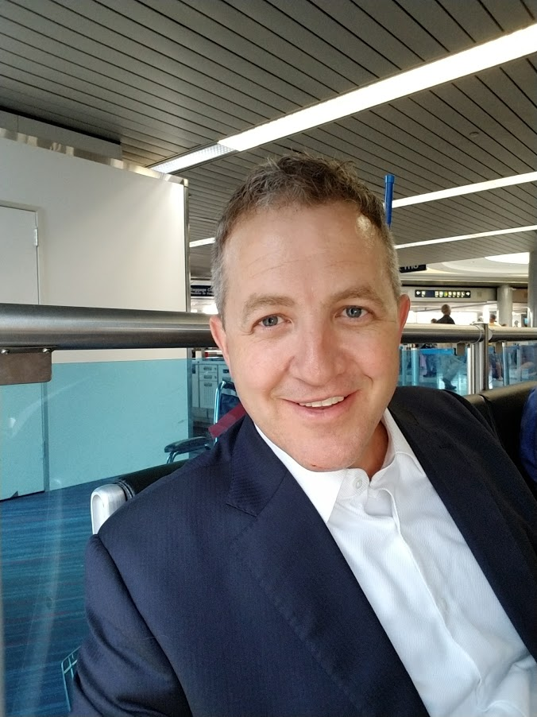

    

        
    

I am an experienced enterprise architect and software engineering leader with over 20 years in the industry. I have a deep understanding of software architecture and design patterns, as well as a proven track record of successfully implementing complex software systems for large organizations. In my current role, I lead a team of software engineers and architects to design and develop enterprise-level software solutions that align with our clients' business goals and objectives. I also work closely with stakeholders and leadership to ensure that our solutions are scalable, secure, and maintainable.

In addition to my technical expertise, I am also a strong communicator and collaborator, able to bridge the gap between technical and non-technical teams. I am passionate about mentoring and developing the skills of the engineers on my team, and I am always looking for ways to improve our processes and practices.

Overall, I am committed to driving innovation and delivering high-quality software solutions that help organizations unlock the value of technology, achieve their goals, and succeed in today's rapidly-changing business landscape.

Currently, I’m focused on helping [Capgemini's Hospitality clients](https://www.capgemini.com/us-en/industries/hospitality-and-travel/) transform their systems.

<Alert type="success">Let's improve people's lives together!</Alert>