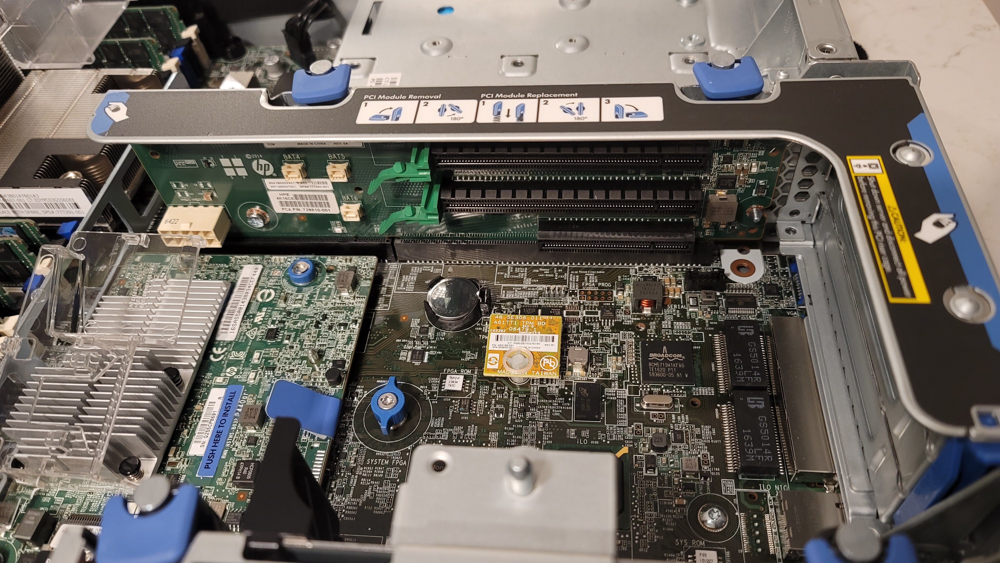

<Text>
I'm run a dedicated <ExternalLink href="https://linuxhandbook.com/homelab/">Homelab</ExternalLink> to learn and experiment with today's leading technologies. 
My goal was to build a complete modern technology stack from bare-metal. 
</Text>

<Title>Components</Title>

### Bare Metal
- [HP ProLiant DL380 G9 Server 2x E5-2697v3 2.60Ghz 28-Core 192GB 4x 4TB P440ar](https://support.hpe.com/hpesc/public/docDisplay?docId=c04438844&page=GUID-8B08D5D4-72EC-4B3C-B3B3-F4CEE740939A.html)
- [HP J9727A Switch 24 Port Gigabit Ethernet 10/100/1000 Base-T 4x SFP Layer 4](https://www.hpe.com/psnow/doc/c04111401?jumpid=in_lit-psnow-red)
- [VNOPN Micro Firewall Appliance](https://www.amazon.com/gp/product/B09J4H9ZXY/ref=ppx_yo_dt_b_asin_title_o04_s00?ie=UTF8&psc=1)
- [Synology DS1512+](https://www.bhphotovideo.com/c/product/854907-REG/Synology_DS1512_DS1512_PLUS_5_BAY_NETWORK.html)

### Virtualiztion
- [XCP-ng](https://xcp-ng.org/?gclid=Cj0KCQiA-oqdBhDfARIsAO0TrGGaFLU8GQrdpoDF-IlfQhskK1ghZGRmenaI4W3Fzu7ecL0V6YPh5K8aAo2AEALw_wcB)
- [Xen Orchestra](https://xen-orchestra.com/)

### Operating Systems
- [Ubuntu 22.04.1 LTS](https://releases.ubuntu.com/22.04/)
- [Debian 11](https://www.debian.org/download)
- [pfSense](https://www.pfsense.org/)

### Container 
- [K8s](https://kubernetes.io/)
- [containerd](https://containerd.io/)
- [Min.io](https://min.io/)
- [MetalLB](https://metallb.universe.tf/)
- [OpenEBS](https://openebs.io/)
- 

### Services
- [Traefik proxy](https://traefik.io/traefik/)

