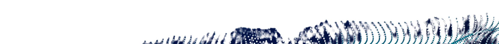

 Hi, :wave: I'm

<Text
    children={`Mark Kirby.  `}
    sx={{ fontSize: [5, 5, 6], fontWeight: `bold`, color: `heading`, lineSpacing: `1.0` }}
  />
  
    <Text
    children={`I help teams harness Technology.`}
    sx={{ px: 4, fontSize: [5, 5, 5], fontWeight: `bold`, color: `headingOther`,  }}
  />
    

        
    

 
Welcome to my website.

I’m a software solutions architect, engineer, and team lead specializing in helping organizations accomplish their strategic technology objectives. Currently, I’m focused on helping [Capgemini's Hospitality clients](https://www.capgemini.com/us-en/industries/hospitality-and-travel/) transform their systems.

Here is a button:
<button style={{ backgroundColor: "blue", color: "white" }}>
  Click me!
</button>